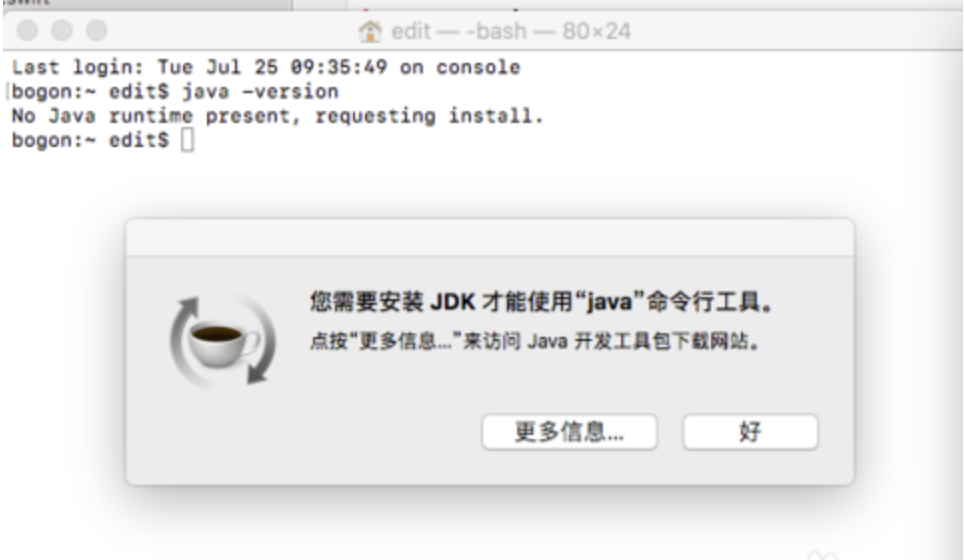
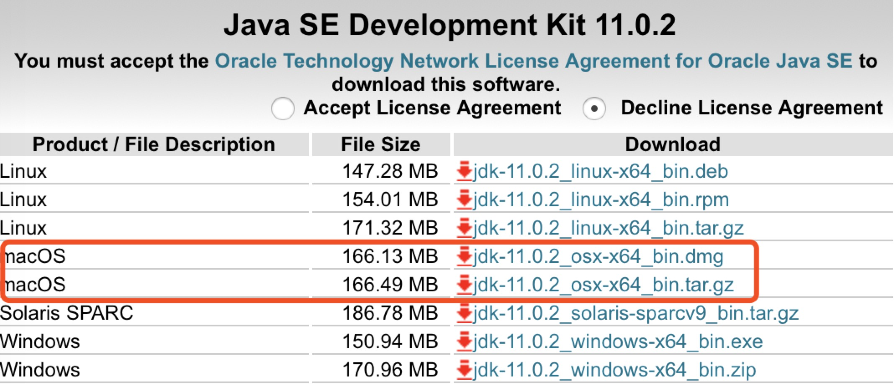
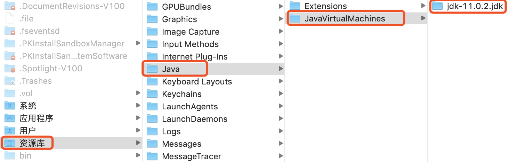
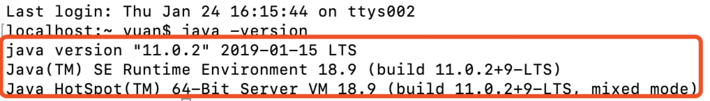
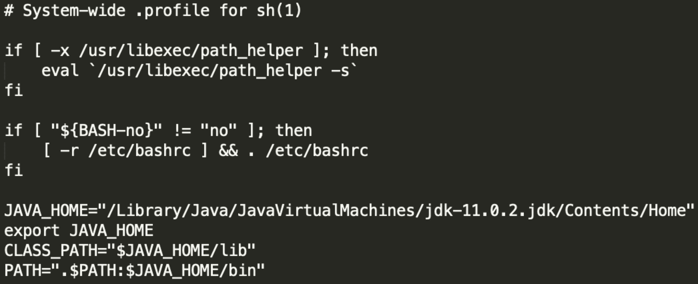

### Mac搭建Java环境
-----

##### 1、查看是否安装了jdk

终端输入 `jaca -verison`

如果没有安装过jdk会提示 需要安装jdk。



##### 2、jdk[下载网址](https://www.oracle.com/technetwork/java/javase/downloads/jdk11-downloads-5066655.html)，我下的是`11.0.2`



##### 3、下载之后就打开dmg，安装。

在资源库下，可以查看文件的路径。



##### 4、输入 java -version  查看java的版本。

如果输出版本信息，说明jdk安装成功。



##### 5、配置环境变量

安装好jdk之后，就开始配置环境变量了。

编辑 /etc/profile

输入如下配置：

```
JAVA_HOME="/Library/Java/JavaVirtualMachines/jdk-11.0.2.jdk/Contents/Home"
export JAVA_HOME
CLASS_PATH="$JAVA_HOME/lib"
PATH=".$PATH:$JAVA_HOME/bin"
```



要想马上生效，输入 `source /etc/profile` 运行profile配置。

检查环境。输入 `echo $JAVA_HOME`


得到配置的路径，说明配置完毕。
